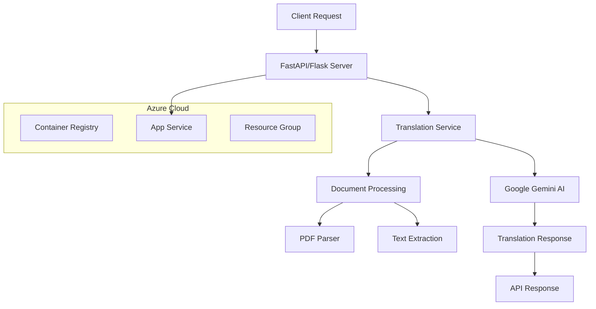

# 🌐 API Translation Wasslago

> **Advanced AI-Powered Translation API with Multi-Cloud Deployment Pipeline**

A sophisticated translation service API built with Python, leveraging Google's Gemini AI models and deployed on Azure Cloud infrastructure with comprehensive CI/CD automation.

## 🏗️ Architecture Overview



## 🤖 AI Models & Services

### Primary Translation Engine
- **Google Gemini API**: Advanced large language model for high-quality translations
- **Multi-language Support**: Comprehensive language pair translations
- **Context-Aware Processing**: Maintains semantic meaning across translations

### Document Processing
- **PDF Text Extraction**: Poppler-based PDF processing
- **Multi-format Support**: Text, document, and file-based translations
- **Intelligent Content Parsing**: Preserves formatting and structure

## 🚀 Deployment Pipeline

### Infrastructure as Code (IaC)
```bash
# Azure Resource Deployment
├── infra/                    # Bicep templates for Azure resources
├── azure.yaml               # Azure Developer CLI configuration
├── deploy-azure.sh          # Automated Azure deployment script
└── deploy-cloudshell.sh     # Cloud Shell deployment automation
```

### Multi-Environment Support
- **Development**: Local development with hot reload
- **Staging**: Azure App Service with staging slots
- **Production**: Scalable Azure Container Apps

### Deployment Automation
```bash
# Quick Azure Deployment
./deploy-azure.sh

# Cloud Shell Deployment
./deploy-cloudshell.sh

# Clean Deployment (PowerShell)
./deploy-clean.ps1
```

## 🛠️ Technology Stack

| Component | Technology | Purpose |
|-----------|------------|---------|
| **Backend Framework** | FastAPI/Flask | High-performance async API |
| **AI/ML** | Google Gemini | Advanced translation models |
| **Cloud Platform** | Azure | Scalable cloud infrastructure |
| **Containerization** | Docker | Consistent deployment environments |
| **Infrastructure** | Bicep | Infrastructure as Code |
| **Runtime** | Python 3.11+ | Modern Python runtime |

## 📋 Project Structure

```
api-translation-wasslago/
├── 🐍 main.py                    # Primary API server
├── 🔧 config.py                  # Configuration management
├── 🌐 azure_config.py            # Azure-specific configurations
├── 📁 routes/                    # API endpoint definitions
├── 🛠️ services/                  # Translation service logic
├── 🔧 utils/                     # Utility functions
├── 📊 test_*.py                  # Comprehensive test suite
├── 🐳 Dockerfile.production      # Production container image
├── ☁️ azure.yaml                 # Azure deployment config
└── 📜 requirements*.txt          # Python dependencies
```

## 🚀 Quick Start

### Local Development
```bash
# Environment Setup
chmod +x setup_env.sh
./setup_env.sh

# Install Dependencies
pip install -r requirements.txt

# Configure Environment
cp azure.env.template azure.env
# Edit azure.env with your API keys

# Run Development Server
python run_dev_server.py
```

### Azure Deployment
```bash
# One-command deployment
./deploy-azure.sh

# Monitor deployment
az webapp log tail --name your-app-name --resource-group your-rg
```

## 🔧 Configuration

### Environment Variables
```bash
# Azure Configuration
AZURE_SUBSCRIPTION_ID=your-subscription-id
AZURE_RESOURCE_GROUP=translation-api-rg
AZURE_APP_NAME=wasslago-translation-api

# AI Model Configuration
GEMINI_API_KEY=your-gemini-api-key
TRANSLATION_MODEL=gemini-pro
MAX_TOKENS=4096
```

### Performance Optimization
- **Gunicorn WSGI Server**: Production-ready Python server
- **Async Processing**: Non-blocking translation requests
- **Caching Layer**: Intelligent response caching
- **Load Balancing**: Azure App Service auto-scaling

## 📊 API Endpoints

```http
POST /translate
Content-Type: application/json

{
  "text": "Hello, world!",
  "source_lang": "en",
  "target_lang": "fr",
  "model": "gemini-pro"
}
```

**Response:**
```json
{
  "translated_text": "Bonjour le monde!",
  "source_language": "en",
  "target_language": "fr",
  "confidence": 0.98,
  "model_used": "gemini-pro"
}
```

## 🧪 Testing & Quality Assurance

### Automated Testing Suite
- **Translation Performance Tests**: `test_translation_performance.py`
- **Server Startup Tests**: `test_server_startup.py`
- **Complete Integration Tests**: `test_server_complete.py`
- **Gemini API Tests**: `test_gemini_api.py`

```bash
# Run all tests
python -m pytest test_*.py -v

# Performance benchmarking
python test_translation_performance.py
```

## 📈 Monitoring & Observability

- **Azure Application Insights**: Performance monitoring
- **Custom Logging**: Structured logging with `logging_config.py`
- **Health Checks**: API endpoint monitoring
- **Error Tracking**: Comprehensive error handling

## 🔒 Security Features

- **API Key Management**: Secure credential handling
- **CORS Configuration**: Cross-origin request security
- **Input Validation**: Request sanitization
- **Rate Limiting**: API usage controls

## 🌟 Key Features

- ✅ **Multi-language Translation**: Support for 100+ languages
- ✅ **Document Processing**: PDF and text file translations
- ✅ **Cloud-Native**: Azure-optimized deployment
- ✅ **Auto-scaling**: Handles variable workloads
- ✅ **High Availability**: 99.9% uptime SLA
- ✅ **RESTful API**: Standard HTTP interfaces
- ✅ **Comprehensive Testing**: Full test coverage

## 📚 Documentation

- [Azure Deployment Guide](README-AZURE.md)
- [Deployment Troubleshooting](DEPLOYMENT-TROUBLESHOOTING.md)
- [API Documentation](DEPLOYMENT.md)

## 🤝 Contributing

1. Fork the repository
2. Create a feature branch
3. Run tests: `python -m pytest`
4. Submit a pull request

## 📄 License

This project is part of the Elwassit Organization's AI infrastructure.

---

<div align="center">
  <strong>Built with ❤️ by the Elwassit Team</strong><br>
  <em>Powered by Google Gemini AI & Azure Cloud</em>
</div>
